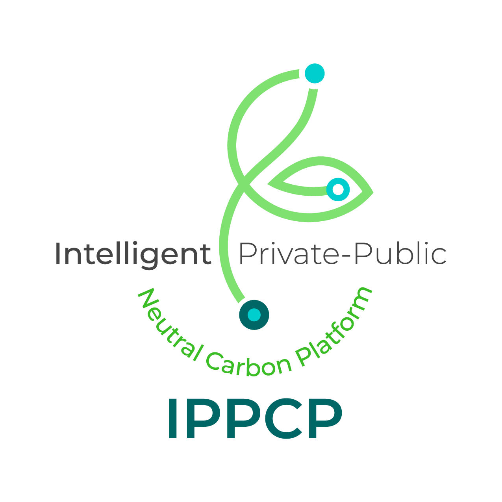

# Intelligent Private-Public Neutral Carbon Platform (IPPCP)

  

IPPCP is a pilot of the European Data Space for Smart Communities (DS4SSCC-DEP). It supports public-private data cooperation for emissions inventories in Zaragoza and Ljubljana, within the broader management of climate, energy, environmental, and pollution data.

The published project duration is 1 May 2025 to 31 August 2026. The pilot was selected in Round 3 of the European data space for smart communities call for pilots.

This page introduces the project and points to material that has already been published. Detailed technical documentation remains in the corresponding repositories.

## Pilots

### Zaragoza

The Zaragoza pilot focuses on data relevant to the municipal emissions inventory. Its public technical automation is the repository linked below.

### Ljubljana

The Ljubljana pilot concerns the controlled exchange of energy, emissions, and environmental data. No Ljubljana source-code repository is currently published in this organization. A link will be added here when the Ljubljana partners publish their technical material.

## Published repositories

### Zaragoza technical automation

[IPPCP-project/ippcp-API](https://github.com/IPPCP-project/ippcp-API)

This is the public Zaragoza technical automation repository. It contains command-line automation for validating IPPCP data exchanges through an INESData data space. It is not the complete IPPCP implementation, and it does not contain Ljubljana's developments.

The executable workshop and the current technical documentation are maintained in that repository. Connector credentials and other operational secrets are not included.

### Other published repositories

The following repositories are also public in this organization. Their own documentation does not present them as the Zaragoza automation or as the Ljubljana pilot implementation.

- [IPPCP-project/datalinker](https://github.com/IPPCP-project/datalinker): an Apache Airflow plugin for constructing and validating knowledge graphs from source data and a diagram. Licensed under Apache License 2.0.
- [IPPCP-project/IPPCP-Ontology](https://github.com/IPPCP-project/IPPCP-Ontology): the Emissions Inventory Ontology, a semantic model for urban and territorial emissions-inventory data. Licensed under CC BY-SA 4.0.

## Consortium

The partners published by Zaragoza City Council and the City of Ljubljana are:

- [Zaragoza City Council](https://www.zaragoza.es/sede/)
- [Ljubljana City Hall (Mestna občina Ljubljana)](https://www.ljubljana.si/)
- [Universidad Politécnica de Madrid](https://www.upm.es/)
- [Geospatiumlab](https://www.geoslab.com/)
- [Envirodual d.o.o.](https://www.envirodual.com/)

## Project information

- [DS4SSCC pilot page](https://www.ds4sscc.eu/ippcp)
- [Zaragoza project page, English](https://www.zaragoza.es/sede/portal/ippcp/en/)
- [Zaragoza project page, Spanish](https://www.zaragoza.es/sede/portal/ippcp/)
- [Ljubljana project page](https://www.ljubljana.si/sl/vizija-ljubljane/projekti-mol/vsi-projekti/platforma-za-ogljicno-nevtralna-mesta-ippcp)

## Funding and disclaimer

IPPCP is a pilot of the European Data Space for Smart Communities (DS4SSCC-DEP).

DS4SSCC-DEP is funded by the European Union Digital Europe Work Programme 2021–2022 under Grant Agreement No. 101123342.

Views and opinions expressed are those of the author(s) only and do not necessarily reflect those of the European Union or the European Commission. Neither the European Union nor the European Commission can be held responsible for them.

Each repository states its own license. This page does not change those licenses.
